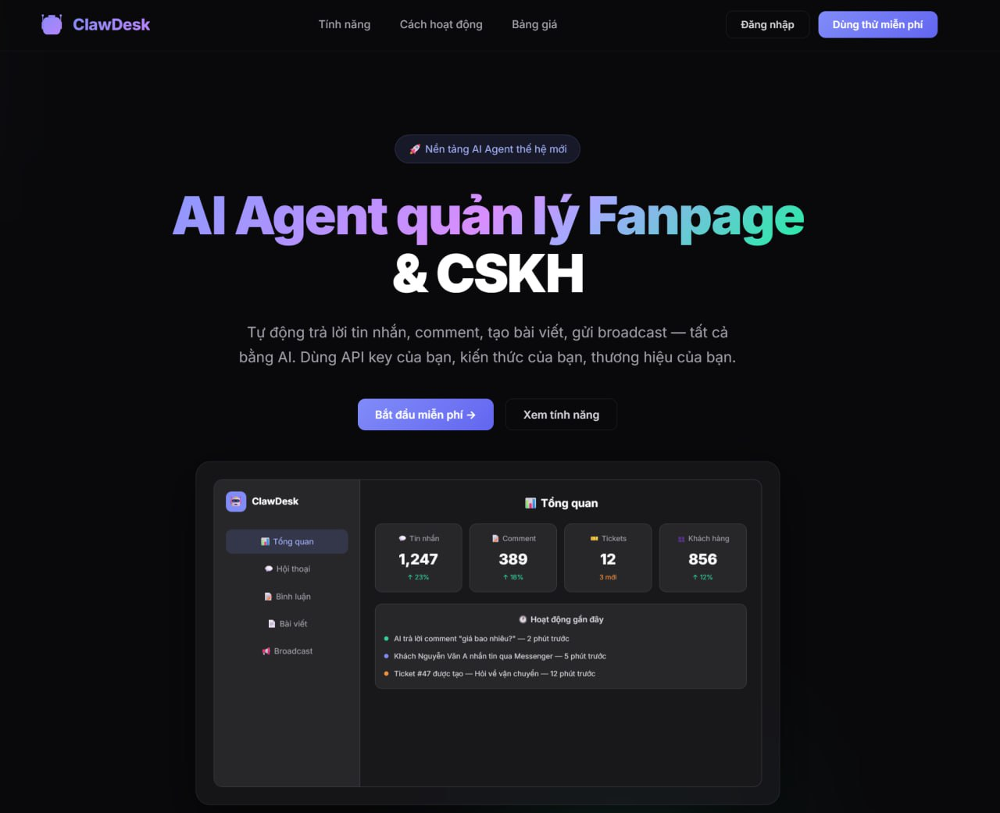
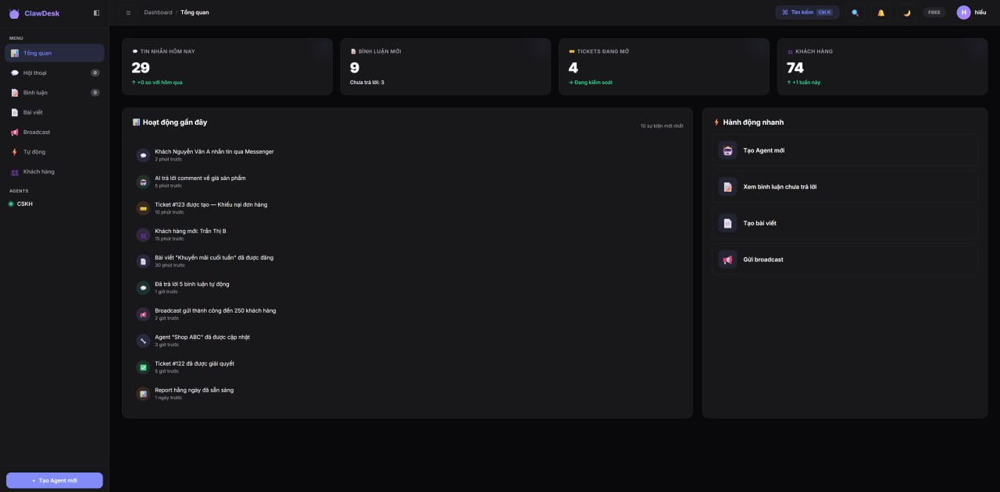
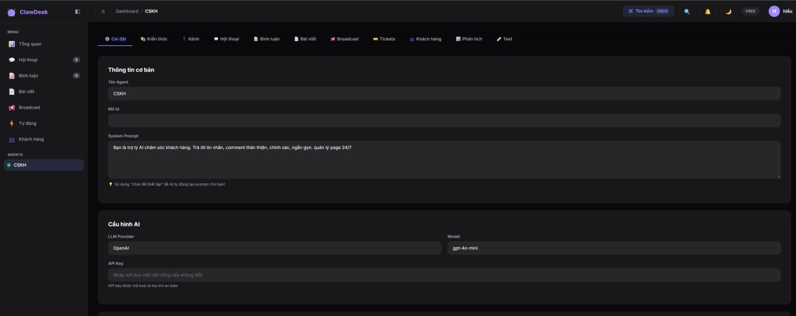

<div align="center">


# ClawDesk

### AI Agent quản lý Fanpage & CSKH cho shop Việt Nam

Tự động trả lời tin nhắn, comment Facebook, tạo bài viết, quản lý đơn hàng — tất cả bằng AI.

[](LICENSE)
[](https://python.org)
[](https://fastapi.tiangolo.com)
[](https://supabase.com)

[🚀 Demo](https://clawdesk-api-production.up.railway.app) · [📖 Tài liệu](#-cài-đặt) · [🐛 Báo lỗi](https://github.com/Paparusi/clawdesk/issues)

</div>

---

## 📸 Screenshots

<div align="center">

### Landing Page


### Dashboard


### Agent Management


</div>

---

## ⚡ Tại sao ClawDesk?

| Vấn đề | Giải pháp ClawDesk |
|---------|-------------------|
| 😩 Trả lời comment thủ công hàng giờ | 🤖 AI auto-reply comment + inbox trong 30 giây |
| 💬 Khách nhắn tin nửa đêm không ai trả lời | ⏰ AI trực 24/7, trả lời tất cả kênh |
| 📝 Viết content đau đầu | ✍️ AI viết bài, lên lịch đăng tự động |
| 📊 Không biết khách nào VIP | 🏷️ CRM tự phân loại: VIP, mới, rủi ro |
| 🛒 Chốt đơn chậm, miss khách | ⚡ AI tự tạo đơn khi khách chốt |

---

## ✨ Tính năng

### 🤖 AI Agent thông minh
- Tự động trả lời tin nhắn & comment **24/7**
- Hỗ trợ **OpenAI**, **Anthropic Claude**, **Google Gemini**
- RAG Knowledge Base — AI đọc hiểu tài liệu shop
- **8 công cụ CSKH** tích hợp sẵn (ticket, escalate, thu thập info...)
- **8 mẫu agent** cho từng ngành (thời trang, mỹ phẩm, F&B, BĐS...)

### 📱 Đa kênh
- **Facebook Messenger** — nhắn tin tự động
- **Facebook Comment** — auto-reply, inbox, hide spam, sentiment analysis
- **Zalo OA** — webhook tích hợp
- **Telegram Bot** — kết nối qua BotFather
- **Webchat Widget** — nhúng vào bất kỳ website nào

### 🛒 E-Commerce tích hợp
- **Quản lý sản phẩm** — giá, tồn kho, danh mục, variants
- **Đơn hàng Kanban** — Mới → Xác nhận → Đóng gói → Giao → Hoàn thành
- **AI tự tạo đơn** — khách chốt trong chat → AI tạo order
- **Tra giá tự động** — "giá bao nhiêu?" → AI tra catalog trả lời ngay

### 📊 Quản lý chuyên nghiệp
- Dashboard analytics real-time
- **Automation rules** — IF khách hỏi giá → THEN inbox chi tiết
- **Broadcast** — gửi tin hàng loạt cho khách cũ
- **Customer CRM** — phân loại VIP 👑, Mới 🆕, Rủi ro ⚠️
- **Quick replies** — gõ `/gia` `/ship` → auto-fill mẫu trả lời
- Export CSV, tìm kiếm hội thoại, ghi chú nội bộ

### 🎨 Giao diện premium
- Dark theme đẹp mắt
- Responsive — desktop + mobile + tablet
- Vietnamese UI xuyên suốt
- Keyboard shortcuts (Ctrl+K, Ctrl+N...)

---

## 💰 Bảng giá

Đơn giản, minh bạch — **trả theo agent**:

| | Agent miễn phí 🆓 | Agent trả phí 💎 |
|---|---|---|
| **Giá** | **0đ** | **100.000đ/tháng** |
| Kênh | Webchat | Facebook, Zalo, Telegram, Webchat |
| Tin nhắn AI | 100/tháng | 500/tháng |
| Comment auto-reply | ❌ | ✅ |
| Broadcast | ❌ | ✅ |
| Export & Analytics | ❌ | ✅ |
| Sản phẩm | 50 | Không giới hạn |
| Automation rules | 2 | Không giới hạn |
| Branding | "Powered by ClawDesk" | Xoá branding |

> 💡 **Ví dụ:** 1 agent = 0đ · 3 agents = 200k/tháng · 5 agents = 400k/tháng

---

## 🚀 Cài đặt

### ☁️ Cloud (Khuyến nghị)

Đăng ký tại **[clawdesk-api-production.up.railway.app](https://clawdesk-api-production.up.railway.app)** — dùng ngay, không cần cài đặt.

### 🏠 Self-host

**Yêu cầu:**
- Python 3.11+
- PostgreSQL (hoặc [Supabase](https://supabase.com) free tier)
- API key từ [OpenAI](https://platform.openai.com) / [Anthropic](https://console.anthropic.com) / [Google AI](https://aistudio.google.com)

**1. Clone repo**
```bash
git clone https://github.com/Paparusi/clawdesk.git
cd clawdesk
```

**2. Cấu hình**
```bash
cp .env.example .env
# Sửa SUPABASE_URL, SUPABASE_SERVICE_KEY trong .env
```

**3. Database migrations**
```bash
# Chạy theo thứ tự trong Supabase SQL Editor:
# schema.sql → migration_v2.sql → ... → migration_v9.sql
```

**4. Chạy server**
```bash
pip install -r requirements.txt
python -m server.main
```

Mở **http://localhost:8080** 🎉

### 🐳 Docker
```bash
docker-compose up -d
```

---

## 🏗️ Tech Stack

| Layer | Technology |
|-------|-----------|
| **Backend** | Python, FastAPI |
| **Database** | PostgreSQL (Supabase) |
| **Frontend** | Vanilla JS, Single-file HTML |
| **AI** | OpenAI, Anthropic Claude, Google Gemini |
| **Channels** | Facebook Graph API, Telegram Bot API, Zalo OA |
| **Deploy** | Railway, Docker |

---

## 🔧 Kiến trúc

```
clawdesk/
├── server/
│   ├── main.py          # FastAPI server (~4,300 lines)
│   ├── db.py            # Database layer
│   └── tools.py         # AI tools (11 tools)
├── static/
│   ├── index.html       # Landing page
│   ├── dashboard.html   # Dashboard SPA
│   └── widget.js        # Embeddable webchat widget
├── database/
│   ├── schema.sql       # Base schema
│   └── migration_v*.sql # Incremental migrations
└── docs/                # Screenshots
```

---

## 📄 License

ClawDesk sử dụng [**Elastic License 2.0 (ELv2)**](LICENSE):

- ✅ Tự do sử dụng, sửa đổi, self-host
- ✅ Dùng cho business/shop/công ty nội bộ
- ❌ Không được cung cấp như dịch vụ hosted cho người khác
- ❌ Không được xoá hệ thống license

> **Nói đơn giản:** Dùng cho shop của bạn = ✅ OK. Clone rồi bán lại = ❌ KHÔNG.

---

## 🤝 Đóng góp

Pull requests are welcome! Vui lòng mở issue trước khi submit PR lớn.

1. Fork repo
2. Tạo branch (`git checkout -b feature/amazing`)
3. Commit (`git commit -m 'Add amazing feature'`)
4. Push (`git push origin feature/amazing`)
5. Mở Pull Request

---

## 📞 Liên hệ

- **GitHub:** [@Paparusi](https://github.com/Paparusi)
- **Email:** hieu766886@gmail.com

---

<div align="center">

Made with ❤️ in Vietnam 🇻🇳

**[⭐ Star repo này](https://github.com/Paparusi/clawdesk)** nếu bạn thấy hữu ích!

</div>
